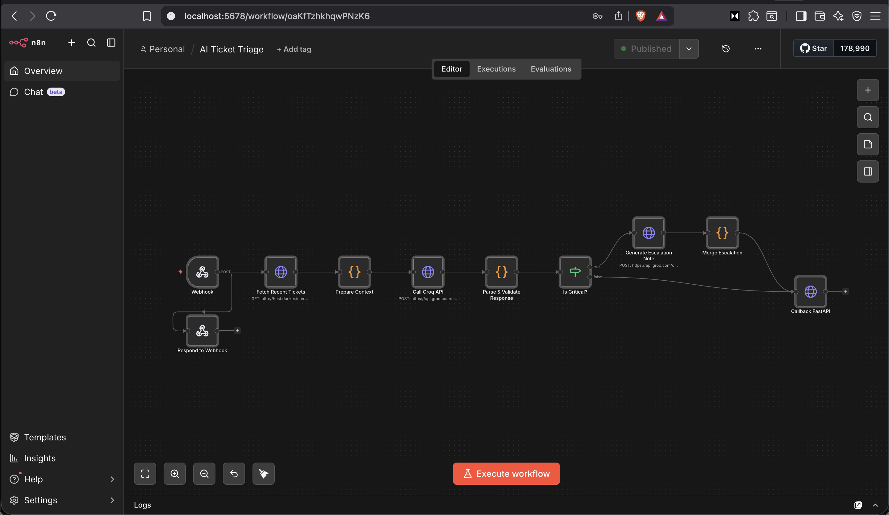
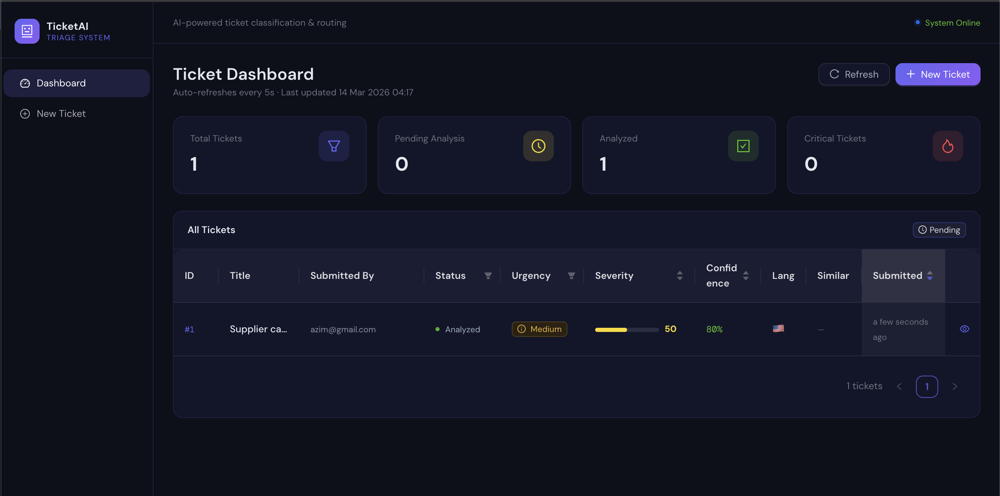
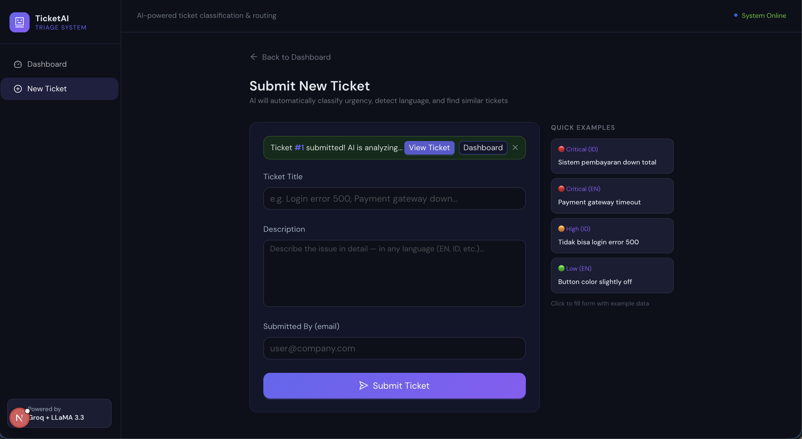
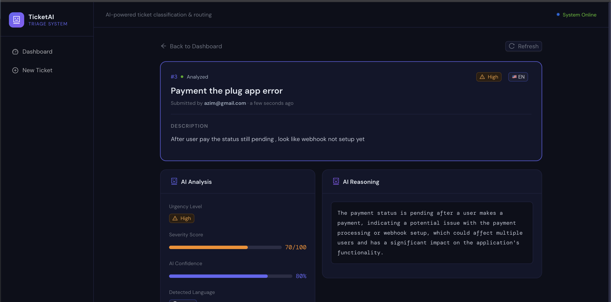

# 🎫 AI Ticket Triage System

An AI-powered support ticket triage system that automatically classifies ticket urgency using LLM, detects similar tickets, and supports multiple languages.

## 🏗️ Tech Stack

- **Backend API:** FastAPI (Python)
- **Database:** MySQL 8.0
- **Workflow Automation:** n8n (Docker)
- **LLM Provider:** Groq API
- **Frontend:** Next.js (React)
- **ORM:** SQLAlchemy (async)
- **Containerization:** Docker Compose

## � Screenshots

### n8n Workflow


### Application Screenshots




## �🚀 Setup

### 1. Clone Repository
```bash
git clone <repo-url>
cd ai-ticket-triage-n8n-fastapi
```

### 2. Setup Environment Variables
```bash
# Copy environment template
cp .env.example .env

# Edit .env and add your GROQ_API_KEY
# GROQ_API_KEY=your_groq_api_key_here
```

### 3. Run Docker Services
```bash
# Start MySQL and n8n containers
docker-compose up -d

# Verify services are running
docker ps
```

### 4. Setup n8n Workflow
1. Open `http://localhost:5678`
2. Create account and login
3. Click **"+"** → New Workflow
4. Click menu **⋮** → **Import from file**
5. Upload `n8n/workflown8n.json`
6. Set up Groq credential:
   - Go to **Settings → Credentials → New**
   - Select **"Header Auth"**
   - Name: `Groq API`
   - Header Name: `Authorization`
   - Header Value: `Bearer YOUR_GROQ_API_KEY`
7. In **"Call Groq API"** node and **"Generate Escalation Note"** node, set Authentication to your `Groq API` credential
8. Toggle workflow **Inactive → Active**

### 5. Setup Backend (FastAPI)
```bash
cd backend

# Create virtual environment
python -m venv venv
source venv/bin/activate  # Windows: venv\Scripts\activate

#Copy root env to backend
cp .env backend/app/.env

# Install dependencies
pip install -r requirements.txt

# Run FastAPI
uvicorn app.main:app --reload --port 8000
```

Verify at: `http://localhost:8000/docs` ✅

### 6. Setup Frontend (Next.js)
```bash
cd ../frontend
pnpm install
cp frontend/.env.example frontend/.env
pnpm run dev
```

Open `http://localhost:3000` ✅

---

## 🔄 System Flow

```
1. User submits ticket via Next.js form
         ↓
2. POST /tickets → FastAPI saves to MySQL (status: pending)
         ↓
3. FastAPI triggers n8n webhook
         ↓
4. n8n fetches recent tickets for context
         ↓
5. n8n sends ticket to Groq LLM with context
         ↓
6. Groq returns: urgency_level + severity_score + confidence_score
              + detected_language + similar_ticket_ids + reasoning
         ↓
7. [If Critical] → Generate escalation note
         ↓
8. n8n calls PATCH /tickets/{id}/analysis → update MySQL (status: analyzed)
         ↓
9. Next.js dashboard shows results via polling
```

---

## 📡 API Endpoints

| Method | Endpoint | Description |
|--------|----------|-------------|
| `POST` | `/tickets/` | Create new ticket |
| `GET` | `/tickets/` | Get all tickets |
| `GET` | `/tickets/{id}` | Get ticket detail |
| `PATCH` | `/tickets/{id}/analysis` | Update AI analysis (n8n callback) |

Full API docs: `http://localhost:8000/docs`

---

## 🧪 Testing

### Test Full End-to-End Flow

```bash
# Submit a ticket
curl -X POST http://localhost:8000/tickets/ \
  -H "Content-Type: application/json" \
  -d '{
    "title": "Login gagal terus",
    "description": "Sejak kemarin tidak bisa login, muncul error 500",
    "submitted_by": "user@example.com"
  }'

# Wait 5 seconds, then check result
curl http://localhost:8000/tickets/1
```

### Test Critical Ticket (triggers escalation)

```bash
curl -X POST http://localhost:8000/tickets/ \
  -H "Content-Type: application/json" \
  -d '{
    "title": "Sistem pembayaran down total",
    "description": "Seluruh transaksi gagal sejak 30 menit lalu, ribuan user tidak bisa checkout, kerugian terus bertambah",
    "submitted_by": "ops@company.com"
  }'
```

### Test Multi-language

```bash
curl -X POST http://localhost:8000/tickets/ \
  -H "Content-Type: application/json" \
  -d '{
    "title": "Payment gateway timeout",
    "description": "Payment gateway keeps timing out for all users, critical revenue impact",
    "submitted_by": "eng@company.com"
  }'
```

---

## 🗄️ Database Schema

```sql
CREATE TABLE tickets (
  id                INT PRIMARY KEY AUTO_INCREMENT,
  title             VARCHAR(255) NOT NULL,
  description       TEXT NOT NULL,
  submitted_by      VARCHAR(255) NOT NULL,
  status            VARCHAR(50) DEFAULT 'pending',
  urgency_level     VARCHAR(50),           -- Low|Medium|High|Critical (AI)
  severity_score    INT,                   -- 1-100 (AI)
  reasoning         TEXT,                  -- AI explanation
  confidence_score  FLOAT,                 -- 0.0-1.0 (AI)
  detected_language VARCHAR(50),           -- ISO 639-1 code (AI)
  similar_ticket_ids TEXT,                 -- JSON array of IDs (AI)
  created_at        DATETIME DEFAULT NOW(),
  updated_at        DATETIME DEFAULT NOW() ON UPDATE NOW()
);
```

---

## 🔧 n8n Workflow Nodes

| Node | Function |
|------|----------|
| Webhook | Receives trigger from FastAPI |
| Respond to Webhook | Immediately acknowledges request |
| Fetch Recent Tickets | GET all tickets for similarity context |
| Prepare Context | Formats data + handles webhook body parsing |
| Call Groq API | Sends ticket to LLM for analysis |
| Parse & Validate Response | Sanitizes and validates AI output |
| Is Critical? | Branches flow for Critical tickets |
| Generate Escalation Note | Extra LLM call for escalation summary |
| Merge Escalation | Appends escalation note to reasoning |
| Error Fallback | Handles LLM failures gracefully |
| Callback FastAPI | PATCH endpoint to update ticket analysis |

---

## 🐛 Troubleshooting

**MySQL Access Denied**
```bash
docker exec -it ticket_mysql mysql -u root -p
# Re-run CREATE USER and GRANT commands
```

**n8n can't reach FastAPI**
```
# n8n runs in Docker, use host.docker.internal instead of localhost
http://host.docker.internal:8000/tickets/
```

**Port 3306 already in use**
```yaml
# docker-compose.yml — change host port
ports:
  - "3307:3306"
```

**DATABASE_URL not found**
```bash
# Make sure .env is in backend/ directory
cp .env.example backend/app/.env
```

---

## 📝 Environment Variables Reference

| Variable | Description | Example |
|----------|-------------|---------|
| `MYSQL_ROOT_PASSWORD` | MySQL root password | `rootpassword` |
| `MYSQL_DATABASE` | Database name | `ticket_db` |
| `MYSQL_USER` | MySQL user | `ticket_user` |
| `MYSQL_PASSWORD` | MySQL user password | `ticket_pass` |
| `DATABASE_URL` | SQLAlchemy connection string | `mysql+aiomysql://...` |
| `N8N_WEBHOOK_URL` | n8n webhook endpoint | `http://localhost:5678/webhook/ticket-triage` |
| `GROQ_API_KEY` | Groq API key | `gsk_...` |
| `FASTAPI_CALLBACK_URL` | FastAPI callback base URL | `http://host.docker.internal:8000/tickets` |

---

## 👨‍💻 Author

Built as part of technical assessment for Junior-Mid Developer position.

> ⚠️ **Security Note:** Never commit `.env` file with real credentials. Always use `.env.example` as template.